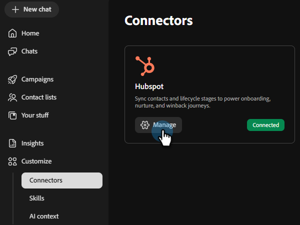

# Connect to HubSpot {#hubspot}

Adobe Coworker Campaigns allows you to connect your HubSpot account to pull in contact lists.

>[!PREREQUISITES]
>
>To use this connector, you must first have:
>
>* An active HubSpot account
>* A [service key](https://developers.hubspot.com/docs/apps/developer-platform/build-apps/authentication/account-service-keys#create-a-service-key) created with the following scopes added: `crm.objects.contacts.read`, `crm.objects.leads.read`, `crm.schemas.contacts.read`, `crm.lists.read`, `crm.export`

## How to connect

1. On the [Coworker Campaigns homepage](https://coworker-campaigns.experience.adobe.com/), click **Customize** and select **Connectors**.

   

1. Click **Add integration**.

   

   >[!NOTE]
   >
   >If this is not your first integration, the button will read "Add connector."

1. In the HubSpot row, click **Connect**.

   

1. A modal appears showing the necessary permissions (listed in the Prerequisites at the top of this article). Click **Continue**.

1. Enter your HubSpot **Service key** and click **Connect**.

   

After connection, HubSpot appears in the Connectors list and can be selected when linking a contact list to sync from HubSpot.

**To disconnect:**

1. In the Connectors screen, find the HubSpot tile and click **Manage**.

   

1. Click **Disconnect** (no need to re-enter your service key at this time).

   

1. Click **Disconnect** again to confirm.

   
