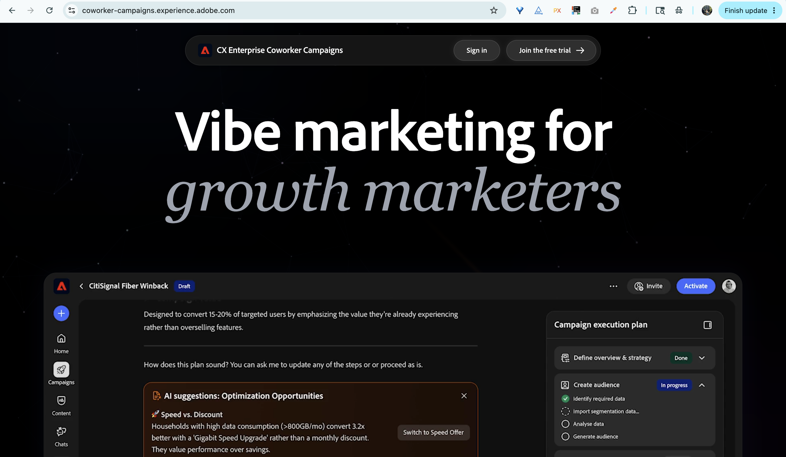

# Adobe CX Enterprise Coworker Campaigns overview {#overview}

Coworker Campaigns is an AI-native marketing application that takes you from a single prompt to a complete review-ready campaign.

At this time, all interactions with the AI will direct you towards [campaign generation](/help/campaigns/create-an-email-campaign.md). More functionality is coming soon.

## How to access

>[!NOTE]
>
>Coworker Campaigns is available via free trial through December 31, 2026. During the trial, all assets and activity is specific to the user.

1. Go to coworker-campaigns.experience.adobe.com.

1. If you have an existing Adobe account, click **Sign in**. If you do not, click **Join the free trial** and create an account using your business email.

   Existing Adobe customers are auto-approved and routed straight to the trial environment to accept the terms.

   New users are prompted to create an account. The Coworker Campaigns team reviews requests and approves business emails. You will receive an email when your request is approved.

1. Accept the trial terms.

1. Set up your brand under **Your stuff** > **Brands**. Coworker Campaigns uses this as the default for every campaign you generate.

1. (Optional) Upload an HTML email template under **Email templates** for Coworker Campaigns to apply your design when generating content.

   {width="800" zoomable="yes"}

You are ready to generate your first campaign.

## A tour of the interface

The Coworker Campaigns interface is organized around a left-hand navigation.

   

| Left Nav Menu | Purpose |
|---|---|
| New chat | Start a new conversation to generate a campaign. |
| Home | Your starting point: prompt bar, recent campaigns, and ready-made campaign templates. |
| Chats | Every conversation you have started that has not yet been generated into a campaign board. |
| Campaigns | Your inventory of all draft and live campaigns. |
| Your stuff | Your brand kits and email templates (the assets Coworker Campaigns uses to keep everything on-brand). |
| Customize | Connectors (Marketo Engage at launch) and Skills (custom behaviors you can apply across campaigns). |

>[!NOTE]
>
>At launch, every conversation in Coworker Campaigns is focused on generating a campaign. Ideation, analysis, and support-style conversations will roll out progressively.

## What you can do with Coworker Campaigns

Coworker Campaigns brings five workflows that usually span five different tools into one conversational experience:

- **Turn a brief into a campaign plan**. Drop in a prompt or upload a brief, and Coworker Campaigns returns a structured, end-to-end plan.
- **Build and refine audiences**. Upload a CSV or connect your data, then refine the segment in conversation.
- **Generate on-brand content**. Coworker Campaigns writes emails that match your brand voice, references, and templates.
- **Design multi-step journeys**. Coworker Campaigns assembles nurture sequences, not just one-off sends.
- **Send proof emails**. Preview every message in your own inbox before launch.
- **Launch and analyze**. _(Coming soon)_ Send campaigns and get next-best-step insights without leaving Coworker Campaigns.

## How the AI works

Coworker Campaigns follows a simple, multi-turn conversational loop:

**Input**. You provide a campaign goal, your audience (uploaded or connected), and optional brand context.

**Processing**. The Coworker Campaigns agentic AI generates a campaign plan, builds a journey, and drafts personalized content. All of which you can make updates to, conversationally.

**Output**. A draft campaign appears on your campaign board, ready for review, iteration, and eventual launch.

You can talk to Coworker Campaigns at any point (for example, "make the second email more urgent," "shorten the subject lines," or "swap the audience to lapsed customers from Q3") and it will update the artifacts in place.

>[!CAUTION]
>
>Always check outputs before sending.

## Tips for getting started

A few things early users have found that make a real difference:

- **Start with a specific, real use case**. "Create a win-back series for customers who have not ordered in 90 days" beats "make me a campaign." See _Use cases_ for specific examples.
- **Clean your audience data**. Coworker Campaigns can only personalize as well as your CSV allows. Exclude any contacts you should not be emailing before you upload.
- **Invest in your brand setup**. Coworker Campaigns extracts brand details when you sign up. A quick review of **Your stuff** > **Brands** benefits every campaign you generate.
- **Send a proof email**. Before you launch, send a proof and review it in your own inbox.
- **Iterate, do not restart**. Treat the Coworker Campaigns first output as a starting point. The fastest path to great is a few rounds of refinement, not a fresh prompt.
- **Export when you need a paper trail**. Export individual emails as HTML or the full campaign as a Word doc or PDF for team review.
- **The escape key**. Press the escape key any time you are in a Campaigns Coworker editor or dialogue (campaigns, journey, etc.) to quickly exit.

## What to know about the trial

Coworker Campaigns is a product in active development. Here is what to know going in:

- **Trial window**: Now through December 31, 2026.
- **Acceptance required**: You will need to review and accept the trial terms before accessing the product.
- **Region**: The free trial is only available to users in North America at this time.
- **Audiences**: Audiences are uploaded via CSV. All audiences are specific to their respective campaigns (they are not stored anywhere else in your environment at this time).
- **Data guidance**: Do not upload sensitive or regulated data. Coworker Campaigns is not currently intended for HIPAA-regulated industries.
- **Compliance**: You are responsible for following email regulations (unsubscribe links, privacy policies, etc.).
- **Send limit**: (_Coming soon_) When Launch is available, you can send up to 5,000 emails per month.

## Video overview

>[!VIDEO](https://video.tv.adobe.com/v/3492807?learn=on){transcript=true}

New capabilities will ship during the trial. Your feedback helps shape what comes next. Submit feedback via the in-product feedback icon in the header.
