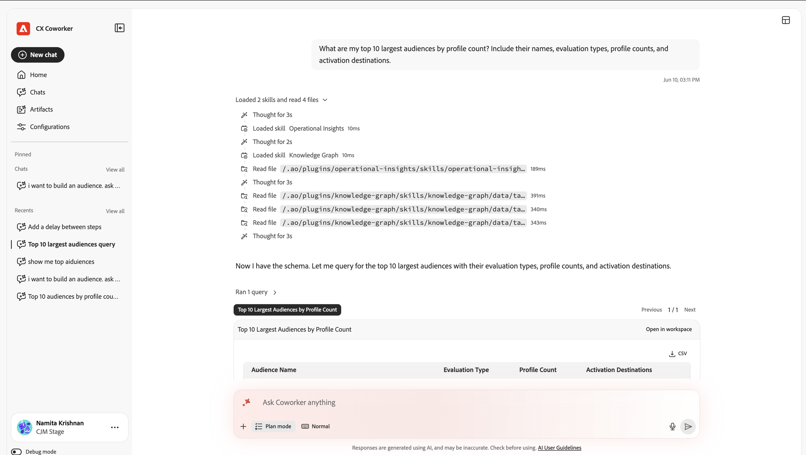
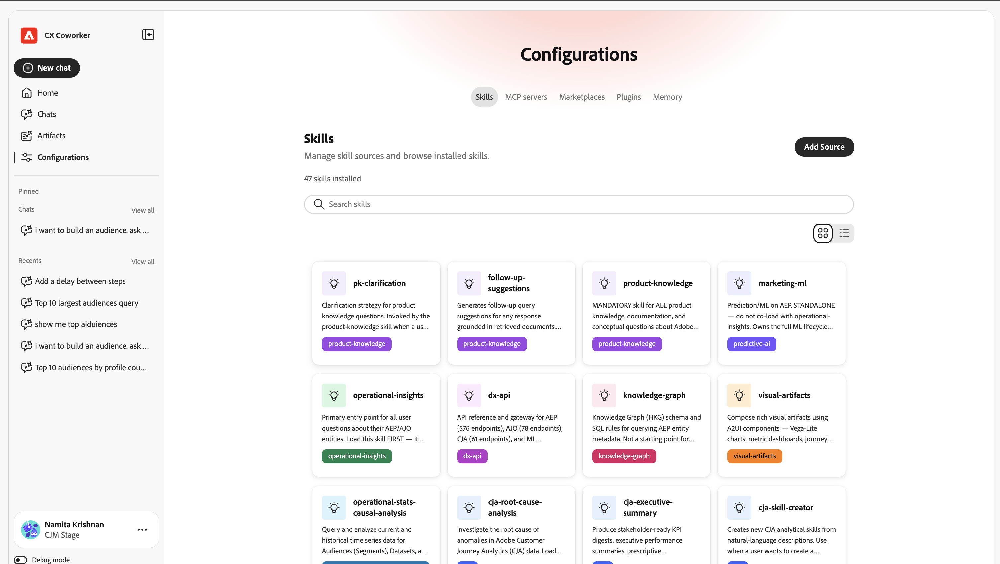

# UI Guide {#ui-guide}

Get oriented with the Coworker Chat interface. This guide covers everything from accessing the app and navigating the workspace to getting the most out of conversations, managing your history, and tailoring your setup.

## Access Coworker Chat

Access Coworker Chat by navigating to [https://experience.adobe.com/#/coworker](https://experience.adobe.com/#/coworker) and signing in with your Adobe credentials.

You can also access it by selecting **Coworker** from the application selector on the top header in CX Enterprise.

## Choose your organization and sandbox

Your current context is shown at the bottom of the left navigation rail, under your name and profile picture. The context determines which data, skills, and connected tools a conversation can reach, so confirm it before you begin.

Select your name to open the account menu, where you can switch context and change workspace settings:

| Interface element | Description |
| --- | --- |
| Theme | Cycle the interface theme between Light and Dark. |
| Settings | Open workspace settings to see details about your account and other settings. |
| Organization picker | Switch the IMS Organization Coworker runs against. |
| Sandbox picker | Switch the active AEP sandbox. |
| CX Applications | Jump to another CX Enterprise application connected to your account. |
| Sign Out | Sign out of your Adobe account. |

## Navigate the interface

The CX Coworker interface has two main areas: the navigation rail on the left, and the conversation canvas that fills the rest of the window.

## The navigation rail

The rail gives you access to every part of the product and to your recent work.

| Interface element | Description |
| --- | --- |
| New chat | Start a fresh conversation. Your current chat is saved to history. |
| Home | Return to the greeting, input box, and suggested prompts. |
| Chats | Open the full chat history to search, pin, archive, or delete conversations. |
| Configurations | Manage Skills, MCP servers, Marketplaces, Plugins, and Memory. |
| Pinned | Conversations you have starred, kept at the top for quick access. Select View all to see them in the Chats page. |
| Recents | Your most recent conversations. Select View all to open the Chats page. |

## The Home screen

The Home screen is where you start. It shows a personalized greeting, the input box, and a set of suggested prompts drawn from what Coworker Chat can help you do in your sandbox.

### Suggested prompts

Under Suggested for you, CX Coworker lists example tasks. Select any suggestion to load it into the input box, then edit it before sending or send it as-is. Suggestions are a fast way to see the kinds of work Coworker Chat supports: moving schemas between sandboxes, finding anomalies in a journey, validating a dataset, and more.

### Entity mentions

Suggested prompts and your own messages can reference specific objects in your sandbox using entity mentions such as +[schema], +[journey], and +[dataset]. An entity mention tells Coworker Chat exactly which object you mean, so it can act on the right schema, journey, dataset, audience, or offer. You can add your own mentions by typing **+**.

## The chat input box

The input box (labeled 'Ask Coworker anything') is where you type. Beneath the text field is a toolbar for attachments, response behavior, voice input, and sending.

| Interface element | Description |
| --- | --- |
| + (Attach) | Open the attach menu to add a file or a data object to the message. |
| Plan mode | Ask Coworker Chat to propose a step-by-step plan and pause for your approval before it acts. Turn it off to let Coworker Chat act directly. |
| Transcript view | Control how much of Coworker Chat's internal activity is shown: Normal, Focus, or Verbose. |
| Microphone | Dictate your message with voice input. Select again to stop recording. |
| Send | Send the message. While Coworker Chat is responding, this becomes a Stop control you can use to interrupt. |

### Attach files and data

Select + to attach context to your message:

- Attach file: upload a file Coworker Chat can read and reference in its response.
- Add data or object: reference an object from your sandbox, such as a dataset or schema, so Coworker Chat works against your live data.

### Plan mode

Turn on Plan mode when a task is complex or changes data, and you want to review the approach first. Coworker Chat responds with a plan and waits for your approval before carrying it out. When Plan mode is off, Coworker Chat proceeds directly to the work.

### Transcript view

The transcript view sets how much of Coworker Chat's reasoning and tool activity appears inline in the conversation:

| Interface element | Description |
| --- | --- |
| Normal | A balanced view: key thinking steps and tool activity are summarized. |
| Focus | A simplified view that hides most intermediate steps so you see mainly the answer. |
| Verbose | The full detail: every thinking step, skill load, file read, and query. |

## Work with responses

When you send a message, Coworker Chat works through the task in the open, then returns its answer. A response can include reasoning, a record of the tools it used, and one or more artifacts.

### Thinking and activity

As it works, Coworker Chat shows what it is doing so you can follow (and verify) its process:

- Thinking blocks: collapsible steps labeled "Thought for" followed by the number of seconds (or milliseconds). Expand one to read Coworker Chat's reasoning.
- Skill activity: entries such as Loaded skill show which specialized capability Coworker Chat brought in for the task.
- File and query activity: entries such as Read file and Ran 1 query record the files Coworker Chat read and the queries it ran, each with how long it took.

>[!TIP]
>
>Use the Verbose transcript view to see every step, or Focus to hide them.

### Artifacts

Results Coworker Chat produces (such as a table of audiences) appear as artifact cards inside the response. From an artifact card you can download table artifacts as a CSV file. When a response includes several artifacts, use the carousel controls (Previous / Next and the count, for example 1 / 1) to move between them.

### Read the analysis

Below its artifacts, Coworker Chat summarizes what the results mean, highlighting notable findings and suggesting follow-up actions you can take next.

### Give feedback and copy responses

Each response has controls to rate and reuse it:

- Thumbs up / Thumbs down: rate the response to help improve future answers.
- Copy: copy the response using Copy as Markdown (keeps formatting) or Copy as Plain Text.

## Manage your chats

Select Chats in the navigation rail to open your full history. Conversations are grouped by date, and each row shows the chat title and how many turns it contains.

| Interface element | Description |
| --- | --- |
| Search by title | Find a past conversation by name. |
| Show pinned | Show only the conversations you have starred. |
| Show archived | Show conversations you have archived. |
| New chat | Start a new conversation. |
| Row menu (…) | On any conversation, star (pin), rename, archive, or delete it. |

## Configurations

Configurations is where you tailor what Coworker Chat can do. It has five tabs: Skills, MCP servers, Marketplaces, Plugins, and Memory.

### Skills

Skills are specialized capabilities Coworker Chat invokes automatically when they are relevant, or that you can trigger yourself by typing / in the chat. The Skills tab lists every installed skill and lets you add more.

- Add Source: install skills from a new source.
- Search: find a skill by name.
- Change view: switch between grid and list layouts using the view toggle.

Select a skill to see its details: the plugin it belongs to, a description of when Coworker Chat uses it, and any files it includes. Select View SKILL.md to read the skill's full definition, or Remove Source to uninstall it.

### MCP servers

MCP (Model Context Protocol) servers connect Coworker Chat to external tools and services, such as Adobe Journey Optimizer, Real-Time CDP, Target, and Workfront. The MCP servers tab lists everything currently connected and how many connections are active.

- Add server: connect a new external tool or service.

Each card shows the server name, its endpoint, and any tags that describe what it provides.

### Marketplaces

Marketplaces are registries of plugins you can browse and install from. The Marketplaces tab lets you add registries and filter them by group.

- Add Marketplace: register a new plugin marketplace.
- Search / Filter by group: narrow the list to find a marketplace.

Each marketplace shows its source and a Ready status once it is available to install from.

### Plugins

Plugins extend Coworker Chat with bundled skills and MCP servers that are installed and managed together as a unit. The Plugins tab shows what is installed and lets you add more from your marketplaces.

- Browse Marketplaces: find new plugins to install.
- Uninstall: remove an installed plugin and everything it bundles.
- Filter by marketplace: see which plugins came from which registry.

### Memory

Memory lets Coworker Chat remember your preferences across conversations so its responses stay relevant and personal over time.

- Enable memory: turn cross-session memory on or off.
- Stored preferences: the preferences Coworker Chat has learned and saved. Each entry can be edited, deleted, or inspected, and entries can be filtered by category.
- Saved memories history: a timeline of changes to your stored memories.

