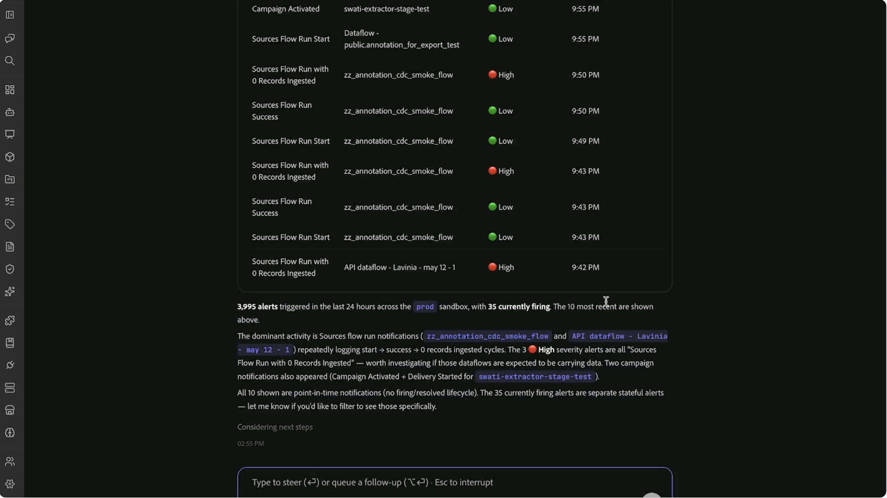

# Customer alert skills

>[!AVAILABILITY]
>
> Customer Alert Skills are available to all customers with access to Adobe CX Enterprise Coworker.
>
> To use Customer Alert Skills, you must have access to Adobe Experience Platform alerts and the resources associated with those alerts.

Use Customer Alert Skills in CX Coworker to turn alert activity into a personalized operational briefing. Review recent alerts, identify high-priority issues, understand which resources are affected, and focus investigation efforts through natural-language conversations.

Customer Alert Skills help you move from alert signals to actionable insights without manually reviewing alert views or correlating information across multiple interfaces. Start with a broad question about recent alert activity, then use follow-up questions to identify recurring alert patterns, analyze impacted objects, and focus on the alerts that you own.

For information about Customer Alerts, see the [Customer Alerts overview](https://experienceleague.adobe.com/en/docs/experience-platform/observability/alerts/overview).

## Prerequisites {#prerequisites}

Before you begin, ensure that you have:

- Access to Adobe Experience Platform.
- Permission to view alerts relevant to your organization.
- The Adobe CXO plugin installed in CX Coworker.

For instructions on installing plugins, see the [Coworker UI guide](../../ui-guide.md).

## Use Customer Alert Skills {#use-customer-alert-skills}

Interact with Customer Alert Skills through CX Coworker using natural-language requests. Ask questions about alert activity, subscriptions, alert trends, or impacted objects. Continue the conversation with follow-up questions to refine the results and focus your analysis.

To use Customer Alert Skills:

1. Navigate to **[!UICONTROL CX Coworker]**.

1. Enter a question or request about your alerts. For example:
    
    *"List all alerts triggered in the last 24 hours?"*

    

1. Review the results returned by Customer Alert Skills.

    

1. Refine the results with follow-up questions. For example:

    *"Show me the top 3 types of alerts triggered in the last 24 hours."*

    

1. Continue narrowing the scope until you identify the alerts, patterns, or impacted objects that require attention. For example:

    *"List the top 5 objects that are impacted by high severity alerts"*

    

Customer Alert Skills maintain conversational context, allowing you to progress from alert activity to focused investigation without repeating previous requests.

## Supported use cases {#supported-use-cases}

Use Customer Alert Skills to monitor operational activity, investigate issues, and focus on the alerts most relevant to your role.

### Review alert activity

Review current alert status or investigate historical alert activity within a specific time period.

For example:

- "What alerts were triggered in the last 24 hours?"
- "Show active alerts from the last seven days."

### Identify recurring alert patterns

Review alert history to identify the alert types that occur most frequently in your organization. Instead of reviewing large numbers of individual alert events, use Customer Alert Skills to summarize recurring patterns and highlight areas that may require attention.

For example:

- "Show me the top 3 triggered alert types."
- "Which alert types occurred most frequently this month?"

### Focus on high-priority issues

Limit results to a specific severity level to prioritize investigation efforts.

For example:

- "Only show high-severity alerts."
- "What critical alerts were triggered this week?"

### Understand the impact radius of alerts

Identify which objects are affected most frequently and understand where investigation should begin.

Customer Alert Skills analyze alert activity and surface the objects associated with recurring or high-severity alerts, helping you focus on the areas with the greatest operational impact.

For example:

- "What are the top 5 impacted objects?"
- "Which objects are associated with the most high-severity alerts?"

### Connect alert types to impacted objects

Understand how alert activity affects specific resources.

Customer Alert Skills connect impacted objects to the alert types that triggered them, helping you identify patterns and determine the likely source of operational issues.

For example:

- "Which alert types impacted this dataset most often?"
- "Show the relationship between alert types and impacted objects."
- "Which alert type affected the top impacted object most frequently?"

### Focus on My Alerts

Analyze the alerts that you subscribe to and are responsible for monitoring.

Use the [!DNL My Alerts] experience to review recent activity, prioritize high-severity issues, and focus operational analysis on the alerts most relevant to your role.

For example:

- "Show me the high-severity alerts I subscribe to."
- "What alerts from [!DNL My Alerts] were triggered this week?"
- "Do any of my subscribed alerts require attention?"

### Manage alert subscriptions

Review and manage alert subscriptions through natural-language conversations.

For example:

- "What alerts am I subscribed to?"
- "Subscribe me to this alert."
- "Remove my subscription to this alert."

## Example prompts {#example-prompts}

Use the following prompts as examples when interacting with Customer Alert Skills.

### Alert activity prompts

- "What happened in the last 24 hours?"
- "What alerts were triggered in the last 24 hours?"
- "Show all alerts triggered this week."
- "Do I have any active alerts?"

### Alert trend prompts

- "Show me the top 3 triggered alert types."
- "Which alert types occurred most frequently this month?"
- "What alert patterns do you see in the last seven days?"

### Severity analysis prompts

- "Only show high-severity alerts."
- "Show critical alerts from the last 30 days."
- "Which high-severity alerts occurred most frequently?"

### Impact analysis prompts

- "What are the top 5 impacted objects?"
- "Which objects are associated with the most alerts?"
- "Show the relationship between alert types and impacted objects."
- "Which alert type affected the top impacted object most frequently?"

### My Alerts prompts

- "Show me the high-severity alerts I subscribe to."
- "What alerts from [!DNL My Alerts] were triggered this week?"
- "Are any of my subscribed alerts currently active?"
- "Do any of my subscribed alerts require attention?"

### Subscription management prompts

- "What alerts am I subscribed to?"
- "Subscribe me to this alert."
- "Remove my subscription to this alert."

## Next steps {#next-steps}

After reading this guide, you should understand how to use Customer Alert Skills in CX Coworker to review alert activity, analyze alert trends, manage alert subscriptions, and investigate operational issues through natural-language conversations.

For more information about alerts, see the [Customer Alerts overview](https://experienceleague.adobe.com/en/docs/experience-platform/observability/alerts/overview).
