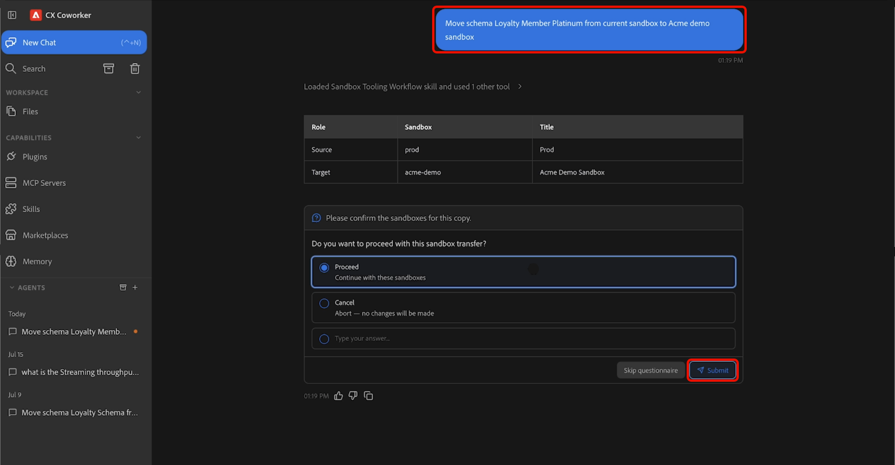

# Sandbox tooling agentic skills

>[!AVAILABILITY]
>
>Sandbox Tooling Agentic Skills are available to all customers with access to Adobe CX Enterprise Coworker. To use all available features, you need the following permissions:
>
>**Manage-sandbox** or **View-sandbox**: These permissions let you use Sandbox Tooling Agentic Skills to view sandboxes directly in Coworker.
>
>**Manage-package**: This permission lets you use Sandbox Tooling Agentic Skills to create packages directly in Coworker.

>[!NOTE]
>
>You can currently use Sandbox Tooling Agentic Skills to discover, package, and migrate schema and audience objects. Support for additional object types will be added in future releases.

Use Sandbox Tooling Agentic Skills to move object metadata—including schemas and audiences—across Adobe Experience Platform environments by describing what you want to accomplish in natural language. Using CX Coworker, you can discover the required metadata, automatically identify dependencies, create migration packages, and migrate objects through a conversational experience.

>[!VIDEO](https://video.tv.adobe.com/v/3496706?learn=on)

## Prerequisites {#prerequisites}

Before you begin, ensure that you have:

- Access to Adobe Experience Platform and the appropriate organization and sandbox.
- Access to the objects that you want to discover or migrate.
- The Adobe CXO plugin installed in CX Coworker.

For instructions on installing plugins, see the [Coworker UI guide](https://experienceleague.adobe.com/en/docs/cx-enterprise-ai/experience-cloud-ai/coworker/chat/ui-guide).

## Use Sandbox Tooling Agentic Skills {#use-sandbox-tooling-agentic-skills}

Interact with Sandbox Tooling Agentic Skills through CX Coworker using natural language. Describe your goal as clearly as possible. Specific requests produce the best results, while vague or overly brief prompts may return lower-quality results or may not invoke the agent.

To use Sandbox Tooling Agentic Skills:

1. Navigate to **[!UICONTROL CX Coworker]**.
1. Enter a clear description of what you want to accomplish. For example:

   *"Move schema Loyalty Member Platinum from the current sandbox to the Acme demo sandbox."*

1. Review the results table, which shows the source and target sandboxes. When you are ready to continue, select **[!UICONTROL Proceed]**, then select **[!UICONTROL Submit]** to confirm.

   

1. Select one or more objects you want to migrate, then select **[!UICONTROL Submit]**.

   

1. Review the objects and dependencies that the agent identifies and confirm the operation actions - *Create New* or *Use Existing*. When you are ready to begin the migration, select **[!UICONTROL Proceed]**, then select **[!UICONTROL Submit]** to confirm. The migration may take several minutes to complete.

   

1. When the migration completes, the selected objects are available in the target sandbox.

   

For more information about using CX Coworker, see the [Coworker UI guide](https://experienceleague.adobe.com/en/docs/cx-enterprise-ai/experience-cloud-ai/coworker/chat/ui-guide).

## Supported use cases {#supported-use-cases}

Explore common ways to use Sandbox Tooling Agentic Skills to simplify sandbox management and metadata migration.

### Move object metadata across sandboxes

As a sandbox administrator managing multiple Adobe Experience Platform sandboxes, you can migrate object metadata using natural-language requests instead of manually navigating the user interface.

Using CX Coworker, you can migrate object metadata—including schemas, audiences, and related configuration assets—from one sandbox to another by describing the migration in natural language. Sandbox Tooling Agentic Skills automatically identify and package the required dependencies, helping ensure a reliable migration.

For example:

- "Move schema Luma Loyalty Members Platinum from the current sandbox to the production sandbox."

### Promote audiences between sandboxes

As a sandbox administrator, you can promote audiences between environments without manually recreating or reconfiguring them.

For example:

- "Promote the 'Audience name' audience to the staging sandbox."

Sandbox Tooling Agentic Skills identify the specified audience, validate its dependencies, and migrate all required objects to the target sandbox.

## Example prompts {#example-prompts}

Use the following prompts as examples when interacting with Sandbox Tooling Agentic Skills.

### Schema prompts

Use these prompts when you know the schema name and destination sandbox.

- "Move schema 'Schema name' from the current sandbox to the production sandbox."

### Audience prompts

Use these prompts when you know the audience name.

- "Promote the 'Audience name' audience to the staging sandbox."

## Next steps {#next-steps}

After reading this guide, you should understand how to use Sandbox Tooling Agentic Skills to discover, package, and migrate supported objects between sandboxes.

For more information about sandbox tooling, see the [Sandbox Tooling guide](https://experienceleague.adobe.com/en/docs/experience-platform/sandbox/ui/sandbox-tooling).
 